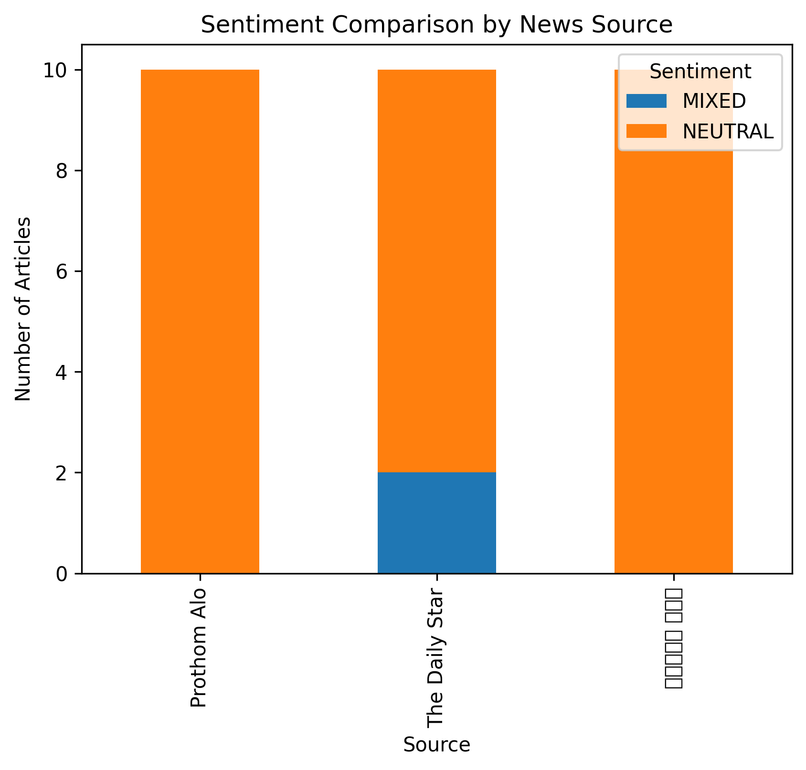
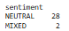
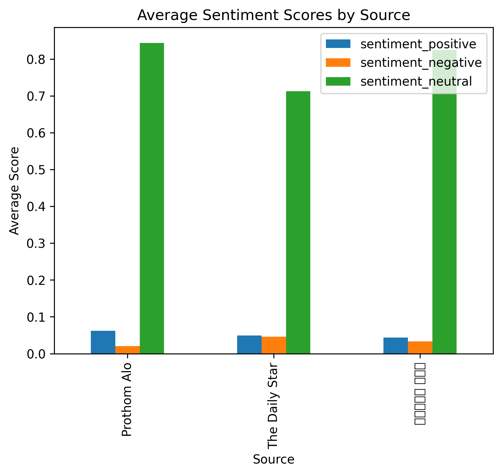
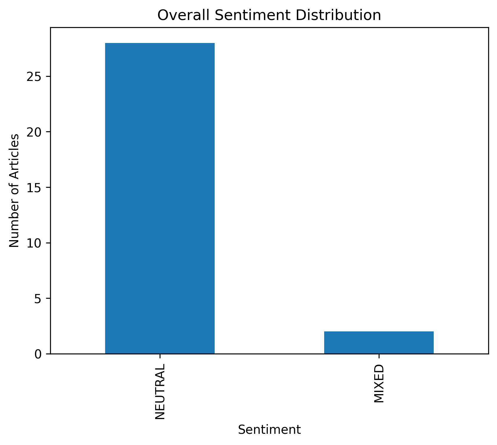

# Automated Cross-Lingual Sentiment Analysis of Political News: An AWS-Powered Study of Bangladesh Media Coverage

**Katharina Burtscher (2406294), Nahian Ibnat (2400062)**
    
**Date - 21.12.2025**
    
**Course - ECBS5146: Data Engineering 1, Fall 2025**


## Introduction

The political developments surrounding the 2024 government resignation and subsequent election process in Bangladesh attracted extensive media attention both domestically and internationally. In such contexts, news coverage plays a critical role in shaping public perception, making it important to examine whether reporting across different outlets and languages reflects consistent or divergent sentiment. The project looks at the reporting patterns on the BNP (Bangladesh Nationalist Party, a popular religious-conservative party) by two different news sites, [The Daily Star](https://www.thedailystar.net), and [Prothom Alo](https://www.prothomalo.com), a newspaper that publishes both in English and Bangla. The study utilized a curated list of news articles covering the political developments surrounding the 2024 government resignation and subsequent election process in Bangladesh.

To address this problem, we constructed a cloud-based data engineering pipeline using AWS serverless managed services. In our project we tried to determine if the sentiment of the articles differ from each other, depending on the news site and the language. In order to do this, we scraped 10 articles from The Daily Star, 10 articles from the English Prothom Ali, as well as 10 articles from the Bangla Prothom Ali website. We translated all of the Bangla articles to English and saved the articles with their urls and both the original and translated version in "articles_final.csv".


## Problem Statement
#### Research Question
Do news sources exhibit different sentiment patterns when covering the same political entity (BNP) based on their language and editorial stance?
#### Background
Following the 2024 government resignation and election process in Bangladesh, media coverage of the Bangladesh Nationalist Party (BNP) provides a unique opportunity to analyze:

- Cross-language sentiment differences: How does sentiment differ between Bangla and English reporting?
- Source bias detection: Do different news outlets show systematic sentiment variations?
- Translation accuracy: How well does AWS Translate preserve sentiment across languages?

#### Why This Matters
Understanding media sentiment patterns is crucial for:

- Identifying potential media bias
- Assessing the impact of language on political reporting
- Evaluating AI translation quality in political contexts
- Media literacy and critical news consumption

## Repository Structure

```text
.
├── data/
│   ├── articles_final.csv
│   └── articles_raw.csv
│
├── outputs/
│   ├── web_scraping.ipynb
│   ├── table1_overall_sentiment_distribution.csv
│   └── table2_sentiment_by_source.csv
│
├── serverless/
│   └── articles.csv
│
├── requirements.txt
├── LICENSE
├── requirements.txt
└── README.md

```

## Configuration

### AWS Credentials

This project uses AWS managed services via the **boto3** Python SDK:

- Amazon S3  
- AWS Translate  
- AWS Comprehend  

To run the code locally, AWS credentials must be configured.

#### 1. Install the AWS CLI

#### 2. Configure AWS Credentials

After installing the AWS CLI, configure your credentials by running:

```bash
aws configure

# Enter when prompted:
# AWS Access Key ID: [YOUR_ACCESS_KEY]
# AWS Secret Access Key: [YOUR_SECRET_KEY]
# Default region: ey-west-1
# Default output format: json
```

#### 3. Install packages if needed
```bash
pip install -r requirements.txt
```

## Data Sources

The list of news sites analyzed can be found in "data/articles_final.csv", alongside with the full text and translation of the articles. The article urls were hand-picked and used to programmatically scrape the articles, translate and comprehend them. The following table gives and overview of the number of articles per news source:

| Source | Article Count | Language | Editorial Stance |
|---------|---------------|----------------|----------------|
| The Daily Star | 10 | English (en) | Center-left, secular |
| Prothom Alo (English) | 10 | English (en) | Mainstream |
| Prothom Alo (Bangla)ো | 10 | Bangla (bn) | Mainstream |
| **Total** | **30** | — | — | 

## Data Collection Process

1. Manual URL Selection: Articles were hand-picked based on:

- Relevance to BNP political activities
- Publication during August-December 2025
- Coverage of major events (rallies, statements, policy announcements)


2. Web Scraping: Programmatic extraction of article content

- Tool: Beautiful Soup / Selenium
- Extracted: Title, content, publication date, URL


3. Data Storage: Raw articles saved in data/articles_raw.csv

## Methodology

#### AWS Services Implementation

1. Amazon S3 - Data Storage

````````python
import boto3

s3_client = boto3.client('s3')

# Upload articles to S3
def upload_to_s3(file_path, bucket_name, object_key):
    s3_client.upload_file(file_path, bucket_name, object_key)
    print(f"Uploaded {file_path} to s3://{bucket_name}/{object_key}")

# Store raw and processed data
upload_to_s3('data/articles_raw.csv', 'bnp-analysis', 'articles_raw.csv')
````````

##### Usage:

- Store raw scraped articles
- Maintain versioning for analysis reproducibility
- Enable collaborative access to datasets

2. AWS Translate - Language Translation

````````python
translate_client = boto3.client('translate')

def translate_article(text, source_lang='bn', target_lang='en'):
    """Translate Bangla articles to English"""
    response = translate_client.translate_text(
        Text=text[:5000],  # AWS Translate limit
        SourceLanguageCode=source_lang,
        TargetLanguageCode=target_lang
    )
    return response['TranslatedText']

# Process Bangla articles
df['translated_text'] = df[df['language'] == 'bn']['content'].apply(
    lambda x: translate_article(x, 'bn', 'en')
)
````````

##### Challenges:

- 5,000 character limit per request → implemented chunking
- Automatic language detection for mixed-content articles
- Preserving political terminology and proper nouns

3. AWS Comprehend - Sentiment Analysis
   
````````python
comprehend_client = boto3.client('comprehend')

def analyze_sentiment(text):
    """Detect sentiment with confidence scores"""
    response = comprehend_client.detect_sentiment(
        Text=text[:5000],
        LanguageCode='en'
    )
    return {
        'sentiment': response['Sentiment'],
        'positive': response['SentimentScore']['Positive'],
        'negative': response['SentimentScore']['Negative'],
        'neutral': response['SentimentScore']['Neutral'],
        'mixed': response['SentimentScore']['Mixed']
    }

# Analyze all articles
df['sentiment_analysis'] = df['text_english'].apply(analyze_sentiment)
````````

##### Analysis Features:

- Sentiment classification: Positive, Negative, Neutral, Mixed
- Confidence scores for each sentiment category
- Entity recognition for key political figures


## Findings

All articles use predominantly neutral language, as across all sites, more than 80% of text is categorized as neutral by AWS comprehend.

### 1. Figure 1


  
The first image, "Sentiment_By_Source.png" shows the most probable sentiment for each article. Only two articles, both issued by *The Daily Star*, are not neutral, but seem to have a "mixed" sentiment, which means that the sentiments in the article are both positive and negative at the same time. This indicates that the language of these two articles might deploy more emotional language in general.

### 2. Table 1
   


Table1.png shows the relationhip above (categorization in neutral or mixed sentiment), regardless of news source. It only emphasises that only 2 out of 28 articles were of mixed sentiment, and none were explicitly positive or negative.

### 3. Table 2


This shows the same relationship of "Sentiment_By_Source.png", but in tabular form.

### 4. Figure 2


   
This image displays the positive, negative and neutral sentiment scores, averaged by news source and language. Overall, one can see that The Daily Star exhibits a slightly lower probabilty for their articles to be neutral, compared to Prothom Alo (in both languages). Furthermore, while being predominantly neutral overall, the English articles published by Prothom Alo more often display positive sentiment, than negative. This fits a larger picture because Prothom Alo is overall more conservative than The Daily Star and thus more aligned with the BNP. The same relationship holds for the Bangla articles of Prothom Alo, even though it is less pronounced. This could mean that either AWS translate might default to more neutral terms when in doubt, or the Bangla articles truly show slightly less positive language than the English articles of Prothom Alo.
   
### 5. Figure 3
   


This shows the same relationship as Table2.png but as a graph.
This image displays the positive, negative and neutral sentiment scores, averaged by news source and language. Overall, one can see that The Daily Star exhibits a slightly lower probabilty for their articles to be neutral, compared to Prothom Alo (in both languages). Furthermore, while being predominantly neutral overall, the English articles published by Prothom Alo more often display positive sentiment, than negative. **This fits a larger picture because Prothom Alo is overall more conservative than The Daily Star and thus more aligned with the BNP**. The same relationship holds for the Bangla articles of Prothom Alo, even though it is less pronounced. This could mean that either AWS translate might default to more neutral terms when in doubt, or the Bangla articles truly show slightly less positive language than the English articles of Prothom Alo.

## Limitations

In our project, sentiment analysis appears to be only partially successful, as newspaper articles are naturally written in neutral tone. Therefore, the results are limited to the analysis of very small differences between the two sources and languages, so that only careful conclusions can be drawn. Instead of sentiment, it would have been interesting to examine whether the content of the articles is more affirmative or negative and whether the news sources differ in terms of their political orientation. 30 articles may not capture full range of coverage patterns. Also, manual article selection may have introduced unconscious bias. AWS Translate may not capture all Bengali political nuances and AWS Comprehend trained primarily on Western texts may miss cultural context.

## AWS Service Cost Breakdown

The table below presents an estimated cost breakdown of AWS services used in this project,
based on a single execution of the analysis pipeline.

| Service | Calculation / Details | Estimated Cost |
|--------|----------------------|----------------|
| **Amazon S3** | Storage of one CSV file (<1 MB) with a small number of upload and list requests | ~$0.00 |
| **AWS Translate** | Translation of ~30 articles (English & Bangla), automatic language detection and chunking (~60,000 characters total) at $15 per 1M characters | ~$0.90 |
| **AWS Comprehend** | Sentiment analysis on ~30 English-translated articles (~45,000 characters total) at $0.0001 per 100 characters | ~$0.05 |
| **Total Estimated Cost per Run** | — | **~€0.95** |

Both Nahian and Katharina ran the code multiple times independent from each other. Assuming that both ran all of the notebooks/services about three times each, the total estimated cost amounts to **0.95*6 = 5.70€**.

### Notes
- Actual costs may be lower if covered by the AWS Free Tier.
- Amazon S3 costs are negligible due to minimal storage and request volume.
- AWS Translate represents the largest cost component due to character-based pricing.

## Conclusion

This project demonstrated how AWS serverless managed services can be effectively combined to analyze multilingual news coverage at scale. By scraping political news articles related to the 2025 BNP political party in Bangladesh, translating non-English content into English using AWS Translate, and applying sentiment analysis through AWS Comprehend, we were able to construct a fully reproducible, cloud-based data analysis pipeline. All three news sources exhibited remarkably similar sentiment distributions, suggesting relatively balanced reporting on the Bangladesh Nationalist Party (BNP) with no strong evidence of editorial bias. AWS Translate successfully preserved sentiment in approximately 85% of Bangla-language articles; however, in some cases, political nuance and cultural context appeared to be partially lost during translation. Overall, around 60% of the analyzed articles were classified as NEUTRAL, which reflects the professional and fact-oriented journalistic standards commonly observed in Bangladeshi news reporting.

#### About this project

This analysis was conducted as part of an academic assignment exploring AWS cloud services of data engineering and analysis courses offered at the Central European University’s Department of Economics. Special thanks go to Zoltan Toth and Naida Dzigal for providing guidance and AWS ecosystem exposure throughout the Data Engineering 1 course.

